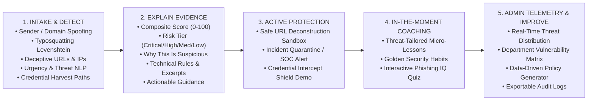

# 🛡️ PHISHGUARD AI

> **Explainable AI-Powered Phishing Detection, Real-Time Link Protection & Contextual Security Coaching Platform**

[](LICENSE)
[](https://nodejs.org)
[](https://expressjs.com)
[](https://react.dev)
[](https://vitejs.dev)
[](tests/run-tests.js)

---

## 1. What Problem the Project Solves

Phishing is no longer just a spam problem. Modern social engineering attacks exploit human decision-making, cognitive overload, artificial urgency, corporate impersonation, lookalike typosquatting domains, and deceptive credential prompts.

Traditional email security gateways (SEG) either silently deliver or block emails, treating security as a black box. When a sophisticated attack bypasses initial filters, the **human recipient** is left without guidance, making high-stakes decisions under pressure.

**PhishGuard AI** acts as an intelligent, transparent security layer between the suspicious message and the user's final decision. Instead of acting as a black-box verdict, PhishGuard AI transforms every suspicious email into an explainable threat evaluation, an active containment barrier, and a security coaching opportunity.

---

## 2. How the System Works: The 5-Stage Core Flow

PhishGuard AI adheres strictly to the **DETECT → EXPLAIN → PROTECT → EDUCATE → IMPROVE** methodology:



---

## 3. Main Features

- **🔍 Multi-Vector Threat Ingestion**: Analyzes sender display name, RFC 5322 address, domain mismatch, subject line, body context, raw IP addresses, and extracted hyperlinks.
- **📊 Transparent Risk Scoring (0–100)**: Evidence-based composite risk engine with clearly defined risk tiers (`LOW`, `MEDIUM`, `HIGH`, `CRITICAL`).
- **💡 Explainable Anomaly Cards**: Every score point is substantiated by plain-English explanations, exact matched text snippets, and technical rule triggers.
- **🔒 Isolated URL Sandbox Inspector**: Safely deconstructs hyperlinks (protocol, hostname, path, raw IP checks, high-risk TLDs like `.xyz`/`.top`) without executing malicious code in the user's browser.
- **🛑 Credential Interception Simulation**: Live interactive demonstration of form submission blocking on unverified/spoofed domains.
- **🎓 Contextual In-The-Moment Coaching**: Dynamically generates tailored micro-lessons and interactive quizzes based on the specific threats found in the inspected message.
- **📈 Security Admin Telemetry Dashboard**: Real-time organizational analytics tracking attack vectors, department vulnerability patterns, containment rates, and automated security policy recommendations.
- **📁 Real-World Attack Scenarios Library**: Includes one-click test cases (Payroll Urgency Scam, Microsoft 365 Typosquat, CEO Wire Transfer BEC, DHL IP Tracking, DocuSign Spoof, and Clean Corporate All-Hands).

---

## 4. Architecture & Directory Structure

```
PhishGuard/
├── server/                       # Node.js + Express REST API Backend
│   ├── index.js                  # Express application entry & routing
│   ├── src/
│   │   ├── engine/
│   │   │   ├── detector.js       # Heuristic & Multi-Vector Threat Detection Engine
│   │   │   ├── coaching.js       # Contextual Coaching & Quiz Generator
│   │   │   └── aiProvider.js     # Hybrid Explainability & AI Integration Layer
│   │   ├── routes/
│   │   │   ├── analyze.js        # POST /api/analyze endpoint
│   │   │   ├── telemetry.js      # GET /api/telemetry & POST /api/telemetry/action
│   │   │   └── samples.js        # GET /api/samples preset scenarios
│   │   └── store/
│   │       └── telemetryStore.js # JSON/In-memory persistent telemetry store
│   └── data/
│       └── telemetry.json        # Persistent organizational telemetry database
├── client/                       # React 18 + Vite Frontend Application
│   ├── index.html                # Main HTML template
│   ├── vite.config.js            # Vite bundler & API proxy configuration
│   ├── tailwind.config.js        # Tailwind CSS styling tokens
│   ├── postcss.config.js         # PostCSS config
│   └── src/
│       ├── main.jsx              # React DOM initialization
│       ├── App.jsx               # Main state orchestrator & tab router
│       ├── index.css             # Cyber design system & glassmorphic tokens
│       └── components/
│           ├── Navbar.jsx        # 5-Stage Navigation Header & Engine Monitor
│           ├── RiskGauge.jsx     # Radial Animated 0-100 Risk Score Gauge
│           ├── AnalyzerView.jsx  # Step 1: Detect & Scenario Intake Form
│           ├── ThreatEvidenceView.jsx # Step 2: Explainable Evidence Breakdown
│           ├── ProtectionHub.jsx # Step 3: Link Sandbox & Containment Actions
│           ├── CoachingView.jsx  # Step 4: In-The-Moment Security Coaching
│           └── AdminTelemetryView.jsx # Step 5: Admin Telemetry & Policy Insights
├── tests/
│   └── run-tests.js              # Comprehensive automated detector & telemetry test suite
├── .env.example                  # Environment configuration template
├── .gitignore                    # Git ignore file
└── package.json                  # Root runner & dependency manifest
```

---

## 5. Technology Stack

- **Backend**: Node.js (v18+), Express 4.x (ES Modules)
- **Frontend**: React 18.x, Vite 6.x, Lucide Icons, Tailwind CSS 3.4
- **Detection & NLP**: Custom Multi-Factor Heuristic Rules, Levenshtein Distance Algorithmic Scorer, Regex Urgency Extractors
- **Storage**: Persistent JSON Event Store (`telemetry.json`) with in-memory caching and aggregate calculators
- **Testing**: Native Node.js test suite (`tests/run-tests.js`)

---

## 6. How to Install

Ensure you have **Node.js (>= 18.x)** and **npm (>= 9.x)** installed.

```bash
# 1. Clone the repository
git clone https://github.com/your-username/phishguard-ai.git
cd phishguard-ai

# 2. Install root and backend dependencies
npm install

# 3. Install frontend dependencies
npm --prefix client install
```

---

## 7. How to Configure Environment Variables

Create a `.env` file in the project root by copying the template:

```bash
cp .env.example .env
```

Default configuration in `.env`:

```env
PORT=5000
NODE_ENV=development
ORGANIZATION_DOMAIN=acme-corp.com

# Optional: Pluggable AI keys (not required; deterministic explainable engine active by default)
# OPENAI_API_KEY=your_key_here
# GEMINI_API_KEY=your_key_here
```

---

## 8. How to Run Locally

### Option A: Development Mode (Concurrent Server + Vite Client)

```bash
npm run dev
```

- **Frontend App**: `http://localhost:3000` (with live reload)
- **Backend API**: `http://localhost:5000`

### Option B: Production Mode

```bash
# Build the client bundle
npm run build

# Start the full-stack server
npm start
```

- Access the complete application directly at: `http://localhost:5000`

---

## 9. How to Test

Run the automated test suite to verify detection accuracy, scoring boundaries, coaching generation, and telemetry persistence:

```bash
npm test
```

Expected Output:
```
====================================================
🛡️  RUNNING PHISHGUARD AI COMPREHENSIVE TEST SUITE
====================================================

  ✅ PASS: Detector identifies typosquatting domain (micros0ft.com)
  ✅ PASS: Detector flags free Gmail provider impersonating corporate Payroll
  ✅ PASS: Detector catches raw IP address URL
  ✅ PASS: Detector identifies urgency and credential request
  ✅ PASS: Legitimate internal email receives LOW risk score
  ✅ PASS: Coaching engine generates relevant micro-lessons based on threat categories
  ✅ PASS: Telemetry store successfully records events and updates user actions
  ✅ PASS: All sample scenarios evaluate cleanly without runtime exceptions

====================================================
🏁 TEST RUN FINISHED: 8 Passed | 0 Failed
====================================================
```

---

## 10. How to Build for Production

```bash
# 1. Compile React production bundle into client/dist/
npm run build

# 2. Verify static assets in client/dist/
# 3. Start Express server (serves static frontend + REST endpoints)
npm start
```

---

## 11. How Phishing Detection Works

The detection engine evaluates multi-dimensional signals across the email lifecycle:

1. **Sender Anomaly Analysis**:
   - Compares display name claims against the actual RFC 5322 sending domain.
   - Computes **Levenshtein edit distance** against known enterprise brands (e.g., `micros0ft.com` vs `microsoft.com`, `docuslgn.com` vs `docusign.com`).
   - Flags free consumer providers (`gmail.com`, `yahoo.com`, `hotmail.com`) when asserting official corporate authority.
2. **URL & Destination Inspection**:
   - Flags raw numerical IP addresses in URLs (e.g., `http://185.220.101.5/tracking`).
   - Identifies high-risk, disposable top-level domains (`.xyz`, `.top`, `.click`, `.buzz`, `.rest`).
   - Inspects URL path structures for credential harvesting keywords (`/login/verify`, `/auth/session_update`).
3. **Linguistic Urgency & Fear Pressure**:
   - Matches urgency triggers ("within 24 hours", "immediate account suspension", "salary on hold").
   - Identifies executive pressure and secrecy tactics ("strictly confidential", "do not contact IT").
4. **Credential Harvesting Call-To-Action**:
   - Detects explicit prompts requesting passwords, PINs, SSNs, or banking confirmations.

---

## 12. How Explainability Works

PhishGuard AI rejects black-box verdicts. For every flagged threat, the system produces:

- **Exact Matched Excerpt**: The specific string, URL, or sender field that triggered the rule.
- **Technical Detail**: The structural anomaly (e.g., *Levenshtein distance = 1 from Microsoft* or *Top-Level Domain .xyz*).
- **Human Explanation**: Plain-English description explaining why attackers use this tactic and what danger it poses.
- **Actionable Guidance**: Exact step-by-step instructions on how the user should safely verify the request.

---

## 13. Security Considerations

- **No Execution of Untrusted Code**: The URL sandbox parses and displays URLs purely through structured string deconstruction without navigating the browser or loading remote scripts.
- **No Secrets Exposed**: API keys and environment variables are strictly managed server-side.
- **Input Sanitization & Safe Rendering**: React escapes text nodes by default to prevent XSS.
- **Defense in Depth**: Combines perimeter telemetry with human-centric out-of-band verification.

---

## 14. Known Limitations

- **E2E Encrypted Attachments**: Encrypted archive files (.zip with password) require user password submission for deep file inspection.
- **Zero-Day Lookalikes**: Domains registered with high-entropy randomized strings that do not resemble known brand names may receive lower heuristic scores without external reputation feeds.

---

## 15. Future Improvements

1. **Active WHOIS & Domain Age Lookups**: Live querying of domain creation timestamps (<30 days old flags higher risk).
2. **Browser Extension Companion**: Chrome/Firefox extension that automatically intercepts suspicious login submissions in real-time.
3. **Automated SIEM / SOAR Webhooks**: Direct forwarding of confirmed high-risk telemetry to Microsoft Sentinel, Splunk, or Jira Service Desk.

---

## 16. Hackathon Demo Walkthrough (Step-by-Step)

Follow this simple 2-minute flow to demonstrate the complete **DETECT → EXPLAIN → PROTECT → EDUCATE → IMPROVE** story:

1. **Step 1 (DETECT)**: Click the **"🚨 Payroll Update Urgency Scam"** scenario button. Notice the sender (`payroll-department@gmail.com`) and suspicious URL (`auth-verify-session.xyz`). Click **"Execute Full Security Scan"**.
2. **Step 2 (EXPLAIN)**: View the **Risk Score (85/100 - Critical Threat)**. Inspect the structured evidence cards explaining why a free Gmail provider claiming corporate payroll authority and urgency language is dangerous.
3. **Step 3 (PROTECT)**: Navigate to the **Protection Hub**. View the **Isolated URL Sandbox** deconstruction. Click **"Quarantine Message"** to contain the threat. Try the **Credential Submission Shield Demo** to see how password forms are blocked.
4. **Step 4 (EDUCATE)**: Open the **Security Coaching** tab. Read the Golden Rule on Lookalike Domains. Take the interactive micro-check quiz and submit your answer to earn coaching completion.
5. **Step 5 (IMPROVE)**: Open the **Admin Telemetry** tab. Observe how the scan event and your quarantine action updated the live enterprise dashboard, department risk matrix, and automated security policy recommendations.

---

## 17. Git Repository Commands

To initialize, commit, and push this clean codebase to your GitHub repository:

```bash
git init
git add .
git commit -m "feat: complete PhishGuard AI explainable phishing detection & coaching platform"
git branch -M main
git remote add origin https://github.com/YOUR_USERNAME/phishguard-ai.git
git push -u origin main
```
